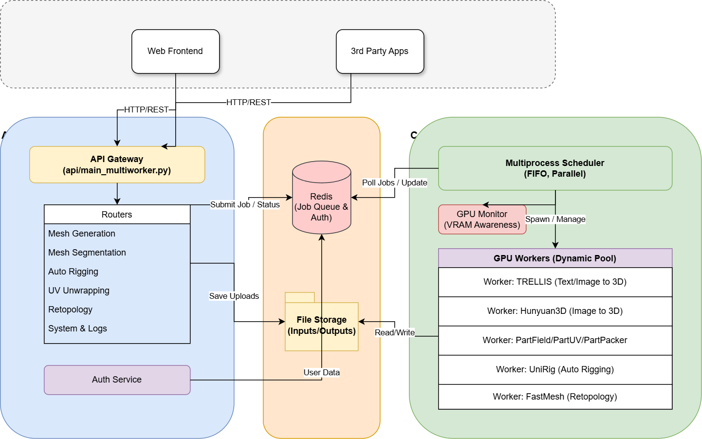
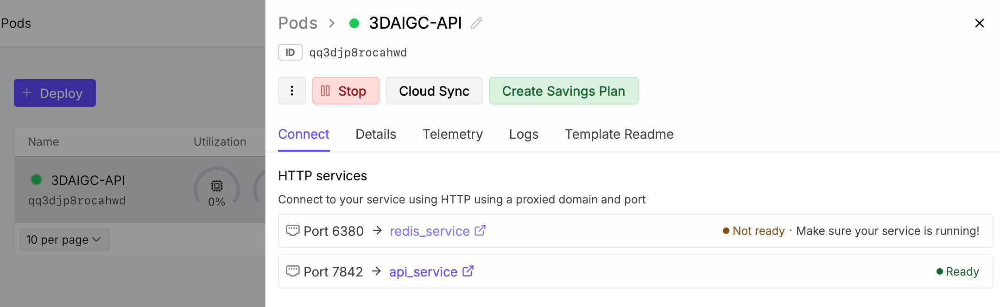
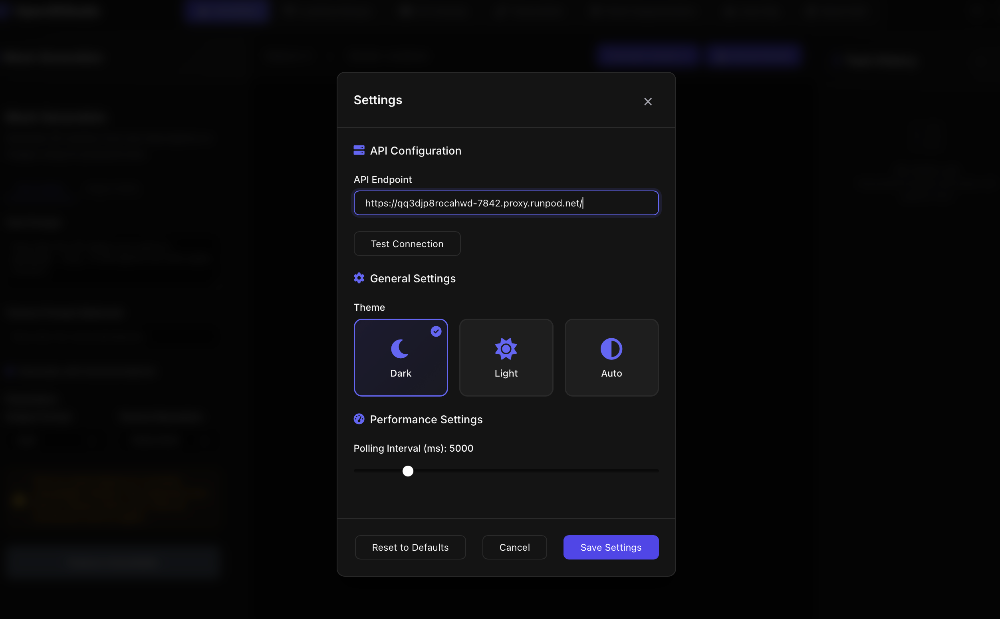

# 3DAIGC-API: Scalable 3D Generative AI Backend
[](https://python.org)
[](https://fastapi.tiangolo.com)
[](LICENSE)
[](https://hub.docker.com/r/fishwowater/3daigc-api)
[](https://youtu.be/LNteOF3XmmI)

A **self-hosted, comprehensive and scalable** FastAPI backend server framework for 3D generative AI models, with all of them ported to API-ready inference services

The system is powered with GPU resource management, concurrent and VRAM-aware GPU scheduling. It can be used together with **Open3DStudio, an open-source replicate of TripoStudio**.

## CHANGELOG
#### Updates 02.05 
* Add support for [Runpod](https://console.runpod.io/deploy?template=bb0j8jta3y&ref=djra5vej), it takes only a single click to deploy this backend by yourself! Check the [RunPod Section](https://github.com/FishWoWater/3DAIGC-API/tree/main?tab=readme-ov-file#docker-recommendedj) for more details.

#### Updates 01.17 
* Add support for [TRELLIS.2](https://github.com/microsoft/TRELLIS.2) and [UltraShape1.0](https://github.com/PKU-YuanGroup/UltraShape-1.0) for the feature of mesh generation.
* Add support for [P3SAM](https://github.com/Tencent-Hunyuan/Hunyuan3D-Part/tree/main/P3-SAM) for higher quality 3D-native mesh segmentation.
* Add a new feature: **mesh editing** and integrate [VoxHammer](https://github.com/Nelipot-Lee/VoxHammer) for that.
* **Removed** the feature of part completion, and remove Hunyuan3D-2.0 to keep the env clean.
* Expose model-specific advanced parameters to the client.

#### Updates 12.03
* Support running in authorization mode(need register/login/API token) besides the annonymous mode(all clients see all jobs)
* Separate the router layer from the scheduler layer, allowing multiple uvicorn workers, which improves concurreny in terms of normal requests like job polling and downloading.
* Fix concurreny issues of the scheduler, allowing multiple workers across multiple GPUs executing jobs at the same time (same model or not), largely boosting computational throughput.
* Support **docker(one-line command to start up)**, where the redis-server, api worker, scheduler work as separate services.


## System Architecture


## Use Case (with Open3DStudio)


### Key Features
- **VRAM-Aware Scheduling**: Intelligent GPU resource allocation based on model requirements
- **Dynamic Model Loading**: Models are loaded/unloaded on-demand to optimize memory usage
- **Multi-Model Support**: Unified interface for various 3D AI models
- **Async Processing**: Non-blocking request handling with job queue management
- **Format Flexibility**: Support for multiple input/output formats (GLB, OBJ, FBX)
- **RESTful API**: Clean, well-documented REST endpoints with OpenAPI specification

## Supported Models & Features
The VRAM requirement is from the pytest results, tested on a single 4090 GPU.
### Text/Image to 3D Mesh Generation
| Model | Input | Output | VRAM | Features |
|-------|-------|--------|------|----------|
| **[TRELLIS](https://github.com/FishWoWater/TRELLIS)** | Text/Image | Textured Mesh | 12GB | Medium-quality, geometry & texture |
| **[Hunyuan3D-2.1](https://github.com/Tencent-Hunyuan/Hunyuan3D-2.1)** | Image | Raw Mesh | 8GB | Fast, medium quality, geometry only |
| **[Hunyuan3D-2.1](https://github.com/Tencent-Hunyuan/Hunyuan3D-2.1)** | Image | Textured Mesh | 19GB | Medium-quality, geometry & texture |
| **[TRELLIS.2](https://github.com/microsoft/TRELLIS.2)** | Image | Textured Mesh | 24GB | High-quality textured geometry |
| **[UltraShape](https://github.com/bytedance/UltraShape)** | Image | Textured Mesh | 25GB | High-quality textured geometry |
| **[PartPacker](https://github.com/NVlabs/PartPacker)** | Image | Raw Mesh | 10GB | Part-Level, geometry only |

### Automatic Rigging 
| Model | Input | Output | VRAM | Features |
|-------|-------|--------|------|----------|
| **[UniRig](https://github.com/VAST-AI-Research/UniRig)** | Mesh | Rigged Mesh | 9GB | Automatic skeleton generation |

### Mesh Segmentation 
| Model | Input | Output | VRAM | Features |
|-------|-------|--------|------|----------|
| **[PartField](https://github.com/nv-tlabs/PartField)** | Mesh | Segmented Mesh | 4GB | Semantic part segmentation |
| **[P3SAM](https://github.com/Tencent-Hunyuan/Hunyuan3D-Part/tree/main/P3-SAM)** | Mesh | Segmented Mesh | 48GB | Semantic part segmentation |


### Texture Generation (Mesh Painting)
| Model | Input | Output | VRAM | Features |
|-------|-------|--------|------|----------|
| **[TRELLIS Paint](https://github.com/FishWoWater/TRELLIS)** | Text/Image + Mesh | Textured Mesh | 8GB/4GB | Text/image-guided painting |
| **[Hunyuan3D-2.1 Paint](https://github.com/Tencent-Hunyuan/Hunyuan3D-2.1)** | Mesh + Image   | Textured Mesh | 12GB | High-quality texture synthesis, PBR |

### Mesh Re-topology (Auto Regressive Mesh Generation)
| Model | Input | Output | VRAM | Features |
|-------|-------|--------|------|----------|
| **[FastMesh](https://github.com/jhkim0759/FastMesh)** | Dense Mesh |  Low Poly Mesh| 16G/24(1k/4k) | **Fast** Artist Mesh Generation |

### Mesh UV Unwrapping 
| Model | Input | Output | VRAM | Features |
|-------|-------|--------|------|----------|
| **[PartUV](https://github.com/EricWang12/PartUV/)** | Mesh | Mesh w/ UV | 7GB | Part-Based UV Unwrapping |

### Mesh Editing (Local 3D Editing)
| Model | Input | Output | VRAM | Features |
|-------|-------|--------|------|----------|
| **[VoxHammer](https://github.com/Nelipot-Lee/VoxHammer)** (Text) | Mesh + Text Prompts | Edited Mesh | 40GB | Text-guided local mesh editing |
| **[VoxHammer](https://github.com/Nelipot-Lee/VoxHammer)** (Image) | Mesh + Reference Images | Edited Mesh | 40GB | Image-guided local mesh editing |


## Quick Start
### Runpod (Recommended)
Use the cloud compute provided by [RunPod](https://www.runpod.io) to deploy your own backend with **a single click**. I have provided the runpod template [here](https://console.runpod.io/deploy?template=bb0j8jta3y&ref=djra5vej)

How-To: Select the template --> Select a machine based on your use-case --> Deploy On-Demand. After runpod setups the template, you can see a http service marked as **ready**. Then copy the url and setup in the Open3DStudio's settings tab.




If desired, you can setup your huggingface token via the environment variable `HUGGIINGFACE_TOKEN` for the downloading of some gated models(e.g. DINO-V3, RemBG). And you can setup `P3D_USER_AUTH_ENABLED` to enable authentification.

If you don't have a RunPod account yet, you can use my [Referral Link](https://runpod.io?ref=djra5vej) to support this project :)

### Docker (Recommended)
```shell
# start up the service in the background
# docker will check local images -> pull images -> build
docker compose up -d 
# force build 
docker compose up --build 

# enable the user management 
P3D_USER_AUTH_ENABLED=True docker compose up -d 
```

### Manual Installation
#### Prerequisites
- Python 3.10+
- CUDA-compatible GPU (each model has its own VRAM requirement)
- Linux (tested on Ubuntu 20.04 and CentOS8)

1. **Clone the repository**:
```bash
# clone this repo recursively 
# notice that the support of a number of models is based on MY FORK TO add API-READY interfaces
git clone --recurse-submodules https://github.com/FishWoWater/3DAIGC-API.git
cd 3DAIGC-API
```

2. **Run the installation script**:
```bash
# on linux
chmod +x install.sh
./scripts/install.sh
# on windows (still base on trellisv1)
.\scripts\install.bat 
```
The installation script will:
- Set up the TRELLIS.2 environment as base.
- Install all model dependencies (PartField, Hunyuan3D, UniRig, PartPacker).
- Install FastAPI and backend dependencies.

3. **Download pre-trained models(optional, or download automatically)**:
```bash
# on linux 
chmod +x download_models.sh
# download specific model(s)
./scripts/download_models.sh -m partfield,trellis
# Verify all existing models
./scripts/download_models.sh -v
# Show help
./scripts/download_models.sh -h
# List available models
./scripts/download_models.sh --list

# on windows, simiarly 
.\scripts\download_models.bat
```

#### Running the Server
```bash 
chmod a+x ./scripts/run_multiwork.sh
./scripts/run_multiworker.sh
```


The server will be available at `http://localhost:7842` by default.
Once the server is running, visit:
- **Interactive API docs**: `http://localhost:7842/docs`
- **ReDoc documentation**: `http://localhost:7842/redoc`

## Usage Examples
### Basics
<details>
<summary>Querying the Basic System Status</summary>

```bash 
# check system status 
curl -X GET "http://localhost:7842/api/v1/system/status/"
# check available features 
curl -X GET "http://localhost:7842/api/v1/system/features"
# check available models 
curl -X GET "http://localhost:7842/api/v1/system/models"
```
</details>
<br>
<details>
<summary>Example Response Querying the Features</summary>
```json
{
  "features":[
    {"name":"text_to_textured_mesh",
      "model_count":1,
      "models":["trellis_text_to_textured_mesh"]
    },
    {"name":"text_mesh_painting",
    "model_count":1,
    "models":["trellis_text_mesh_painting"]
    },
    {"name":"image_to_raw_mesh",
    "model_count":2,
    "models":["hunyuan3d_image_to_raw_mesh","partpacker_image_to_raw_mesh"]
    },
    {"name":"image_to_textured_mesh",
    "model_count":2,
    "models":["trellis_image_to_textured_mesh","hunyuan3d_image_to_textured_mesh"]
    },
    {"name":"image_mesh_painting",
    "model_count":2,
    "models":["trellis_image_mesh_painting","hunyuan3d_image_mesh_painting"]
    },
    {"name":"mesh_segmentation",
    "model_count":1,
    "models":["partfield_mesh_segmentation"]
    },
    {"name":"auto_rig",
    "model_count":1,
    "models":["unirig_auto_rig"]
    },
  ],
  "total_features":8
}
```
</details>

### User Management
<details>
<summary>User Register</summary>

```bash
# user register
curl -X POST http://localhost:7842/api/v1/users/register \
  -H "Content-Type: application/json" \
  -d '{"username":"alice","email":"alice@example.com","password":"secret123"}'
```
</details>

<br>
<details>
<summary> User Login and Get Token</summary>

```bash 
# login and get token
TOKEN=$(curl -s -X POST http://localhost:7842/api/v1/users/login \
  -H "Content-Type: application/json" \
  -d '{"username":"alice","password":"secret123"}' | jq -r '.token')

echo "Your token: $TOKEN"
```
</details>

### Text to 3D Mesh
<details>
<summary>Text to 3D Mesh Example</summary>

```bash
# 1. Submit job 
curl -X POST "http://localhost:7842/api/v1/mesh-generation/text-to-textured-mesh" \
  -H "Content-Type: application/json" \
  -d '{
    "text_prompt": "A cute robot cat",
    "output_format": "glb",
    "model_preference": "trellis_text_to_textured_mesh"
  }'
# Response: {"job_id": "job_789012", "status": "queued", "message": "..."}
# 2. Check job status
curl "http://localhost:7842/api/v1/system/jobs/job_789012"
```

</details>

### Image to 3D Mesh
<details>
<summary> Image to 3D Mesh Example </summary>

```bash
# 1. Upload image file
curl -X POST "http://localhost:7842/api/v1/file-upload/image" \
  -F "file=@/path/to/your/image.jpg"
# Response: {"file_id": "abc123def456", "filename": "image.jpg", ...}

# 2. Generate textured mesh using file ID
curl -X POST "http://localhost:7842/api/v1/mesh-generation/image-to-textured-mesh" \
  -H "Content-Type: application/json" \
  -d '{
    "image_file_id": "abc123def456",
    "texture_resolution": 1024,
    "output_format": "glb",
    "model_preference": "trellis_image_to_textured_mesh"
  }'
```
</details>

### Mesh Segmentation
<details>
<summary> Mesh Segmentation Example </summary>

```bash
# 1. Upload mesh file
curl -X POST "http://localhost:7842/api/v1/file-upload/mesh" \
  -F "file=@/path/to/mesh.glb"
# Response: {"file_id": "mesh_abc123", ...}
# 2. Segment mesh
curl -X POST "http://localhost:7842/api/v1/mesh-segmentation/segment-mesh" \
  -H "Content-Type: application/json" \
  -d '{
    "mesh_file_id": "mesh_abc123",
    "num_parts": 8,
    "output_format": "glb",
    "model_preference": "partfield_mesh_segmentation"
  }'
# 3. Download segmented result
curl "http://localhost:7842/api/v1/system/jobs/{job_id}/download" \
  -o "segmented.glb"
```
</details>

### Auto-Rigging

<details>
<summary> Auto Rigging Example </summary>

```bash
# 1. Upload mesh file
curl -X POST "http://localhost:7842/api/v1/file-upload/mesh" \
  -F "file=@/path/to/character.glb"
# Response: {"file_id": "char_xyz789", ...}
# 2. Generate rig
curl -X POST "http://localhost:7842/api/v1/auto-rigging/generate-rig" \
  -H "Content-Type: application/json" \
  -d '{
    "mesh_file_id": "char_xyz789",
    "rig_mode": "skeleton",
    "output_format": "fbx",
    "model_preference": "unirig_auto_rig"
  }'
# 3. Download rigged mesh
curl "http://localhost:7842/api/v1/system/jobs/{job_id}/download" \
  -o "rigged_character.fbx"
```
</details>

### Mesh Retopology

<details>
<summary> Mesh Retopology Example </summary>

```bash
# 1. Upload mesh file
curl -X POST "http://localhost:7842/api/v1/file-upload/mesh" \
  -F "file=@/path/to/high_res_mesh.obj"
# Response: {"file_id": "mesh_abc123", ...}

# 2. Retopologize mesh (V1K variant for ~1000 vertices)
curl -X POST "http://localhost:7842/api/v1/mesh-retopology/retopologize-mesh" \
  -H "Content-Type: application/json" \
  -d '{
    "mesh_file_id": "mesh_abc123",
    "model_preference": "fastmesh_v1k_retopology",
    "output_format": "obj",
    "seed": 42
  }'
# Response: {"job_id": "retopo_job_123", ...}

# Alternative: Use V4K variant for ~4000 vertices
curl -X POST "http://localhost:7842/api/v1/mesh-retopology/retopologize-mesh" \
  -H "Content-Type: application/json" \
  -d '{
    "mesh_file_id": "mesh_abc123",
    "model_preference": "fastmesh_v4k_retopology",
    "output_format": "obj"
  }'

# 3. Download retopologized mesh
curl "http://localhost:7842/api/v1/system/jobs/{job_id}/download" \
  -o "retopo_mesh.obj"

# 4. Check available retopology models
curl "http://localhost:7842/api/v1/mesh-retopology/available-models"
```
</details>

### UV Unwrapping
<details>
<summary> Mesh UV Unwrapping Example </summary>

```bash
# 1. Upload mesh file (must be without UV coordinates)
curl -X POST "http://localhost:7842/api/v1/file-upload/mesh" \
  -F "file=@/path/to/mesh_no_uv.obj"
# Response: {"file_id": "mesh_xyz456", ...}

# 2. Generate UV coordinates
curl -X POST "http://localhost:7842/api/v1/mesh-uv-unwrapping/unwrap-mesh" \
  -H "Content-Type: application/json" \
  -d '{
    "mesh_file_id": "mesh_xyz456",
    "distortion_threshold": 1.25,
    "pack_method": "blender",
    "save_individual_parts": true,
    "output_format": "obj",
    "model_preference": "partuv_uv_unwrapping"
  }'
# Response: {"job_id": "uv_job_456", ...}

# Alternative: Skip UV packing for faster processing
curl -X POST "http://localhost:7842/api/v1/mesh-uv-unwrapping/unwrap-mesh" \
  -H "Content-Type: application/json" \
  -d '{
    "mesh_file_id": "mesh_xyz456",
    "distortion_threshold": 1.5,
    "pack_method": "none",
    "save_individual_parts": false,
    "output_format": "obj"
  }'

# 3. Download mesh with UV coordinates
curl "http://localhost:7842/api/v1/system/jobs/{job_id}/download" \
  -o "mesh_with_uv.obj"

# 4. Check available packing methods
curl "http://localhost:7842/api/v1/mesh-uv-unwrapping/pack-methods"
```
</details>

### UltraShape - High-Quality Mesh Generation
<details>
<summary> UltraShape Refined Mesh Generation Example </summary>

```bash
# 1. Upload image file
curl -X POST "http://localhost:7842/api/v1/file-upload/image" \
  -F "file=@/path/to/image.jpg"
# Response: {"file_id": "img_abc123", ...}

# 2. Generate refined mesh using UltraShape
curl -X POST "http://localhost:7842/api/v1/mesh-generation/image-to-raw-mesh" \
  -H "Content-Type: application/json" \
  -d '{
    "image_file_id": "img_abc123",
    "output_format": "glb",
    "model_preference": "ultrashape_image_to_raw_mesh",
    "num_inference_steps": 50,
    "num_latents": 32768,
    "octree_res": 1024,
    "seed": 42
  }'
# Response: {"job_id": "ultra_job_123", ...}

# 3. Download refined mesh
curl "http://localhost:7842/api/v1/system/jobs/ultra_job_123/download" \
  -o "refined_mesh.glb"
```
</details>

### VoxHammer - Local Mesh Editing
<details>
<summary> Text-Guided Mesh Editing Example </summary>

```bash
# 1. Upload mesh file
curl -X POST "http://localhost:7842/api/v1/file-upload/mesh" \
  -F "file=@/path/to/mesh.glb"
# Response: {"file_id": "mesh_xyz", ...}

# 2. Edit mesh with text guidance (bounding box mask)
curl -X POST "http://localhost:7842/api/v1/mesh-editing/text-mesh-editing" \
  -H "Content-Type: application/json" \
  -d '{
    "mesh_file_id": "mesh_xyz",
    "mask_bbox": {
      "center": [0.0, 0.5, 0.0],
      "dimensions": [0.3, 0.3, 0.3]
    },
    "source_prompt": "dragon head",
    "target_prompt": "dragon head with horns",
    "num_views": 150,
    "resolution": 512,
    "output_format": "glb",
    "model_preference": "voxhammer_text_mesh_editing"
  }'
# Response: {"job_id": "edit_job_123", ...}

# Alternative: Use ellipsoid mask
curl -X POST "http://localhost:7842/api/v1/mesh-editing/text-mesh-editing" \
  -H "Content-Type: application/json" \
  -d '{
    "mesh_file_id": "mesh_xyz",
    "mask_ellipsoid": {
      "center": [0.0, 0.3, 0.0],
      "radii": [0.2, 0.2, 0.2]
    },
    "source_prompt": "smooth surface",
    "target_prompt": "textured surface",
    "model_preference": "voxhammer_text_mesh_editing"
  }'

# 3. Download edited mesh
curl "http://localhost:7842/api/v1/system/jobs/edit_job_123/download" \
  -o "edited_mesh.glb"

# 4. Check supported mask types
curl "http://localhost:7842/api/v1/mesh-editing/supported-masks"
```
</details>

<details>
<summary> Image-Guided Mesh Editing Example </summary>

```bash
# 1. Upload mesh and reference images
curl -X POST "http://localhost:7842/api/v1/file-upload/mesh" \
  -F "file=@mesh.glb"
# Response: {"file_id": "mesh_abc", ...}

curl -X POST "http://localhost:7842/api/v1/file-upload/image" \
  -F "file=@source_render.png"
# Response: {"file_id": "src_img", ...}

curl -X POST "http://localhost:7842/api/v1/file-upload/image" \
  -F "file=@target_edit.png"
# Response: {"file_id": "tgt_img", ...}

curl -X POST "http://localhost:7842/api/v1/file-upload/image" \
  -F "file=@2d_mask.png"
# Response: {"file_id": "mask_img", ...}

# 2. Edit mesh with image guidance
curl -X POST "http://localhost:7842/api/v1/mesh-editing/image-mesh-editing" \
  -H "Content-Type: application/json" \
  -d '{
    "mesh_file_id": "mesh_abc",
    "source_image_file_id": "src_img",
    "target_image_file_id": "tgt_img",
    "mask_image_file_id": "mask_img",
    "mask_bbox": {
      "center": [0.0, 0.5, 0.0],
      "dimensions": [0.4, 0.4, 0.4]
    },
    "num_views": 150,
    "resolution": 512,
    "model_preference": "voxhammer_image_mesh_editing"
  }'

# 3. Download edited mesh
curl "http://localhost:7842/api/v1/system/jobs/{job_id}/download" \
  -o "edited_mesh.glb"
```
</details>
<br>
For more examples, check out [API doc](./docs/api_documentation.md). Notice that the uploaded file may have a expired time.

### Testing
Directly test the adapters (no need to start up the server)
```bash
# test all the adapters 
python tests/run_adapter_tests.py 
# test some specific adapter e.g. testing trellis
PYTHONPATH=. pytest tests/test_adapters/test_trellis_adapter.py -v -s -r s
```
Once the server is up, you can query the system-level information 
```bash
# Test basic api endpoints
pytest tests/test_basic_endpoints.py -v -s -r s
# Run the on-demand multiprocesing scheduler 
python tests/test_on_demand_scheduler.py 
```
Or test the integration of each module 
```bash
# submit a job, wait until finished, next job
python tests/run_test_client.py --server-url http://localhost:7842 \
  --timeout 600 --poll-interval 25 --output-dir test_results.sequential --sequential 

# submit all the jobs at once, then monitor all of them (default behavoir)
# timeout larger to cover all the jobs
python tests/run_test_client.py --server-url http://localhost:7842 \
  --timeout 3600 --poll-interval 30 --output-dir test_results.concurrent 
```
The tests based on `curl` is also provided at [curl_tests](./tests/curl/)


## Development
### Project Structure
```
3DAIGC-API/
├── api/                   # FastAPI application
│   ├── main.py            # Entry point
│   └── routers/           # API endpoints
├── adapters/              # Model adapters
├── core/                  # Core framework
│   ├── scheduler/         # GPU scheduling
│   └── models/            # Model abstractions
├── config/                # Configuration files
├── tests/                 # Test suites
├── thirdparty/            # Third-party models
└── utils/                 # Utilities
```

### Configuration
* [system configuration](./config/system.yaml)
* [model configuration](./config/models.yaml)
* [logging configuration](./config/logging.yaml)


### Adding New Models
1. Create an adapter in `adapters/` following the base interface
2. Register the model in `config/models.yaml` and model factory `core/scheduler/model_factory.py`
3. Add adapter test and/or integration tests in `tests`

## User Management (Optional)

The system supports optional user authentication and job isolation. When disabled (default), all clients can see all jobs. When enabled, users can only see their own jobs.

```bash
# Enable `user_auth_enabled` under `config/system.yaml`
uvicorn api.main_multiworker:app --workers 4

# Create first admin user (when auth is enabled)
python scripts/create_admin_user.py
```

**Key Features:**
- Token-based authentication (Bearer tokens)
- Role-based access (USER, ADMIN)
- Jobs automatically linked to users
- Redis-based storage (no extra database needed)

For full documentation, see [User Management Guide](./docs/user_management.md).

## Notes 
1. Frequently loading/unloading models is very slow (as can be observed in the test client). Better to enable ONLY required models and always keep them in the VRAM in practice.
2. A lot of the code is written by vibe coding (Cursor + Claude4), Claude4 is a good software engineer, and I have learnt a lot from him/her in system design. Have a look at [vibe coding prompt](./docs/vibe_coding_prompt.md) and [vibe coding READMEs](./docs/vibe_coding/) if interested.

## TODO
### Short-Term 
- [x] Better orgnaize (cleanup) the output directory of current API service
- [x] Expose and support more parameters (e.g. decimation ratio in mesh generation)
- [ ] Integrate better remeshing algoirthms and native quad-mesh remeshing algoirthms.
- [ ] Support multiview images as the condition in mesh generation models

### Long-Term 
- [x] Job queue and scheduler switches to sql
- [x] Based on this collection of 3D API, replicate/implement a similar 3D studio like Tripo/Hunyuan, where the frontend and the backend can BOTH be deployed easily on personal PCs
- [x] Multi-worker deployment support with Redis-based job queue (router layer separated from scheduler layer)
- [x] User authentication and job isolation system
- [ ] Windows one-click installer

## License
This project is licensed under the Apache License 2.0 - see the [LICENSE](LICENSE) file for details.
Notice that each algorithm **HAS ITS OWN LICENSE**, please check them carefully if needed.

##  Acknowledgment
Special thanks to the authors and contributors of all integrated models and the open-source community.